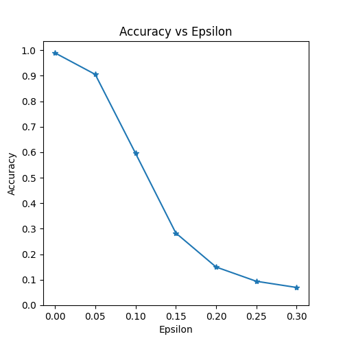
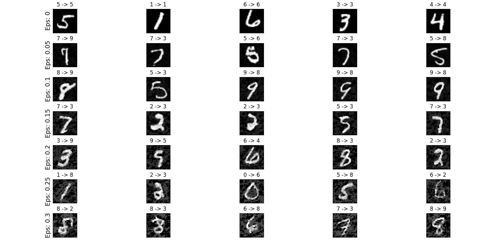
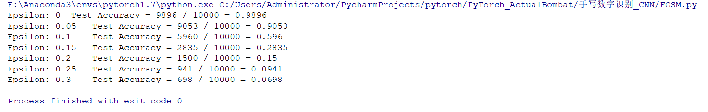

##各个文件介绍
**pen_digits.py**

利用Convolutional neural network(two convolutional layers)进行手写数字的识别，数据集是MNIST，已下载存放在data目录下

包含CNN模型训练、测试

**FGSM.py**

生成对抗样本，比较在不同ε下FGSM的攻击效果

**model.ckpt**

可以直接使用，也可以运行pen_digits.py再训练一次神经网络

运行时间5分钟左右，请耐心等待！

**结论**

Figure_1
Figure_2
Figure_3
